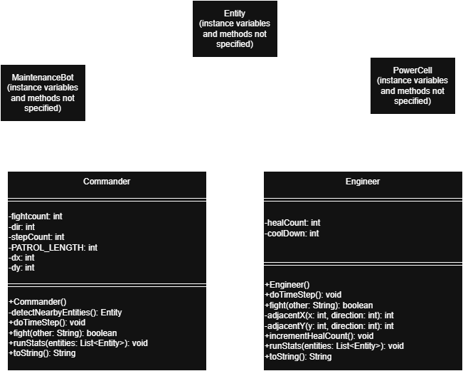

# Lab 3 Design Document: Space Station Simulation

**Name: Aidan Gonzales**  
**EID: AGG3498**  
**Date: 2/15/26**  

---

## 1. System Overview

The design goal of this lab is to simulate a 
self-sustaining ecosystem. The space station is populated with
MaintenanceBots, Engineers, Commanders, and PowerCells,
each with a different purpose (described in section 2).

My final simulation achieves a stable equilibrium under a
variety of conditions. I have tested my simulation with
different entity starting counts, seeds, and a very large
amount of steps. I have found that the simulation works
best for most given seed when the entity counts are all
set to 50 at the start. For most seeds, the entity counts
will fluctuate around 50 for tens of thousands of steps.

---

## 2. Class Descriptions

### 2.1 Commander

Commanders act as the apex predator in this ecosystem.
They attack all entities within a two tile radius. If there 
are no entities nearby, they will patrol their territory until
unknowing prey arrive.

I decided to make commanders very aggressive because I was having
issues with populations increasing too much. By having commanders
act as a sort of "crowd control", I was able to maintain a good
equilibrium.

Since commanders gain a lot of energy from winning fights,
they reproduce at a higher than average energy threshold. This
threshold was settled on after much testing to make sure that the
commanders don't overpower the other entities.

### 2.2 Engineer

Engineers play a healing role for the most critical entities:
the maintenance bots. When a maintenance bot is nearby, the
engineer will move to it and repair it, giving both the
maintenance bot and the engineer itself some energy. This creates
a symbiotic relationship between the two.

In my space station, maintenance bots do all the hard work
on the ship. I designed the engineers to be more of a support role
to assist the maintenance bots in their important duties.

Engineers are somewhat fragile to attacks from commanders, so
their reproduction threshold is a little lower than other
entities. Also, they gain energy from repairing maintenance bots,
so the more that they do their job, the longer they will live.

### 2.3 Other Classes (if modified or relevant)

To allow engineers and commanders to know what entities are
around them, I had to add helper functions to the Entity class.
I added getX() and getY() functions so that I could calculate
how close entities were to engineers and commanders. This
allows them to pathfind to specific targets to heal or attack.

---

## 3. UML Class Diagrams

UML diagram containing the Commander and Engineer
instance variables and methods, and the inheritance
hierarchy between Commander, Engineer, MaintenanceBot,
PowerCell, and Entity.

---

## 4. Ecosystem Design

### 4.1 Entity Roles

| Entity | Role                                          | Energy Strategy                                 | Reproduction Threshold | Fight Behavior                                                       |
|--------|-----------------------------------------------|-------------------------------------------------|------------------------|----------------------------------------------------------------------|
| PowerCell | Energy producer                               | Solar charging (+1/step)                        | N/A                    | Never fights                                                         |
| MaintenanceBot | Complete vital tasks around the space station | Collect power cells and get healed by engineers | 150                    | Always tries to fight, but unfortunately loses                       |
| Commander | Crowd control for other entities              | Take energy from winning fights                 | 200                    | Pathfinds to entities and always tries to fight, but sometimes fails |
| Engineer | Repair maintenance bots                       | Healing maintenance bots rejuvinates engineers  | 130                    | Always tries to flee                                                 |

### 4.2 Balance and Tuning

_Describe the process you went through to balance your ecosystem. Answer questions like:_

- I did most of my testing with a starting entity count of 50 each.
- In my first attempts, many entity populations were going way
 too high. I fixed this by increasing the aggressiveness of my
 commanders. In my later attempts, the engineer population kept
 hitting zero very quickly. I fixed this by having the engineers
 rejuvenate energy when repairing maintenance bots, rather than
 losing energy when repairing them. This system is more of
 a symbiotic relationship between the engineers and maintenance
 bots.
- Using the input formatted as below, my simulation
 produces a stable output for at least 25000 steps with seeds
 13, 24, 100, 143, and many more. I would recommend testing with
 these seed values first, and then seeing what other seeds and
 step values work. For all of these, I used a start of 50 entities 
 each.

Input Format:

seed 143

make PowerCell 50

make MaintenanceBot 50

make Engineer 50

make Commander 50

step 25000

stats MaintenanceBot

stats Engineer

stats Commander

quit

### 4.3 Failure Modes

1. **Failure mode 1:** The first main failure that I experienced
was when the populations of maintenance bots and engineers
were growing way too large. All entities started at the
same population, but very quickly these two entities took off.
To fix this, I increased the aggressiveness of commanders.
I changed their awareness radius from 1 tile to 2 tiles. This
helped keep maintenance bots and engineers under control.
2. **Failure mode 2:** The second main failure that I experienced
was when the population of engineers always dropped to zero.
My original design had it so that engineers lost some
energy when repairing maintenance bots, and after some testing, 
I realized that they were dying off because of this feature. To 
fix this, made it so that engineers gain energy when repairing
maintenance bots. This helped keep the engineer population
much more stable.

---

## 5. Testing

I tested many different inputs and edge cases. I did extensive
testing with an input of 50 entities each, meaning I tried 
tons of different seeds and super high step counts to make
sure that the entity populations properly stabilized for a
long time. I also tested with different entity inputs, and the 
population didn't stabilize for as long, but it was still an 
acceptable amount of stabilization. Overall, I tested my 
simulation extensively, and the simulation gives
amazing results, as populations stabilize for over 25000
steps (and more than this a lot of the time) on many seeds.

---

## 6. Challenges and Lessons Learned

_What was the hardest part of this lab? What would you do differently if you started over? What did you learn about object-oriented design from this experience?_

The hardest part of this lab was the extensive testing
required to make the populations stabilize over many steps. It
took a lot of small tweaks and value adjustments to make it as
stable as it is. If I were to do this lab again, I would not edit
the entity class by adding extra helper functions. This broke the
autograder, and gave me a lot more trouble than I thought it would.
I learned about the restrictions that object-oriented programming
places on child classes. This is a very powerful thing because
parent classes can specify what to allow child classes to access
and/or modify. This is partially what led to my autograder errors.
However, to be fair, I didn't know that the autograder didn't want
me to add extra helper functions. Overall, this lab helped me learn
more about object-oriented design, and improved my testing
and debugging skills.